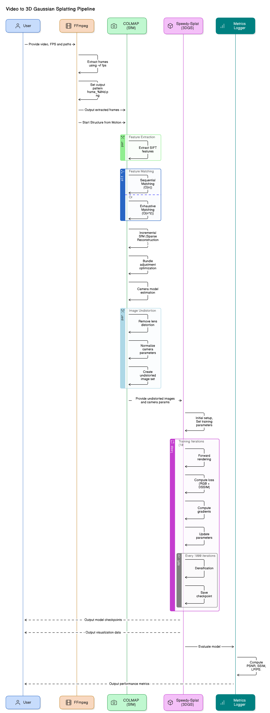

# Video to 3D Gaussian Splatting Pipeline

This repository provides a streamlined pipeline for converting videos into 3D Gaussian Splatting models using COLMAP for Structure-from-Motion (SfM) and Speedy-Splat for model training.  

-> [Blog post](https://www.wirelog.net/posts/2025-04-26-video-to-3dgs/) where I have shared my experience.  


## Prerequisites

- [FFmpeg](https://ffmpeg.org/download.html)
- [COLMAP](https://colmap.github.io/install.html)
- [Speedy-Splat](https://github.com/j-alex-hanson/speedy-splat) dependencies
- Python 3.10+
- CUDA-enabled GPU (recommended) ([CUDA Toolkit](https://developer.nvidia.com/cuda-toolkit))

## Installation

1. Clone this repository:
```bash
git clone --recursive https://github.com/nannigalaxy/video-3d-reconstruction-gsplat.git
cd video-3d-reconstruction-gsplat
```

2. Make scripts executable:
```bash
chmod +x *.sh
```

## Usage

Run the complete pipeline using:

```bash
./video_to_gsplat.sh <fps> <input_video_path> <sfm_output_dir> <gsplat_output_dir_path>
```

### Parameters:

- `fps`: Frame rate for video extraction (e.g. 20)
- `input_video_path`: Path to input video file
- `sfm_output_dir`: Directory for COLMAP output
- `gsplat_output_dir_path`: Directory for final 3D Gaussian Splatting model

### Example:

```bash
./video_to_gsplat.sh 20 ./input.mp4 ./sfm_output ./gsplat_model
```
## Pipeline Overview

The pipeline consists of three main steps:

1. **Frame Extraction**: Extracts frames from input video at specified FPS
2. **Structure from Motion**: Uses COLMAP to perform SfM and generate camera parameters
3. **3D Gaussian Splatting**: Trains a Speedy-Splat model using the processed data




## Components

### Frame Extraction
```bash
ffmpeg -i <input_video> -vf "fps=<target_fps>" "frames/frame_%04d.png"
```

### COLMAP Processing
```bash
./colmap_undistorted_sfm_export.sh <input_images> <output_dir> [--sequential] [--enable_gpu]
```

### Speedy-Splat Training
```bash
./train_speedy_splat.sh <sfm_input_dir> <gsplat_output_dir_path>
```

## Training Parameters

Key Speedy-Splat training parameters:

- Resolution: 1024
- Iterations: 10000
- Position Learning Rate: 0.001 (initial) to 0.0001 (final)
- Feature Learning Rate: 0.0001
- Densification Interval: 1000
- Checkpoint Interval: 1000

## Output Structure

### SFM Output Directory (`sfm_output_dir`)
```
sfm_output_dir/
├── database.db            # COLMAP feature database
├── sparse/               # Sparse reconstruction
│   └── 0/               # First reconstruction
│       ├── cameras.bin  # Camera parameters
│       ├── images.bin   # Image parameters
│       └── points3D.bin # 3D point cloud
├── undistorted/         # Undistorted images
│   ├── images/         # Undistorted input images
│   └── sparse/         # Undistorted reconstruction
└── custom_export/      # Exported formats
    ├── scene.ply       # Point cloud in PLY format
    ├── cameras.txt     # Camera parameters in text
    ├── images.txt      # Image parameters in text
    └── points3D.txt    # 3D points in text format
```

### GS Output Directory (`gsplat_output_dir`)
```
gsplat_output_dir/
├── checkpoints/        # Training checkpoints
│   ├── iteration_2000/
│   ├── iteration_4000/
│   └── iteration_final/
└── point_cloud/       # Point clouds
    ├── iteration_4000/
    └───── point_cloud.ply
```

# Viewing Results

## Gaussian Splatting Output
You can view the trained Gaussian Splatting model using the SIBR viewer, found in speedy-splat dir or pull from [source](https://sibr.gitlabpages.inria.fr/?page=index.html&version=0.9.6). Need to build this to use, follow its instructions.

## Point Cloud Files
The PLY files (found in `gsplat_output_dir/point_cloud/` directory) can be viewed using various 3D visualization tools:
- [Blender](https://www.blender.org/) (using File > Import > PLY)
- [MeshLab](https://www.meshlab.net/)
- [CloudCompare](https://www.cloudcompare.org/)
- [ParaView](https://www.paraview.org/)

# Troubleshooting

## COLMAP Issues
1. **CUDA/GPU Errors**:
   - If COLMAP fails with CUDA errors, try using `--disable_gpu` option
   - Ensure CUDA drivers are up to date
   - Try reducing the maximum image resolution if GPU memory is insufficient

2. **Feature Matching Failures**:
   - Increase image overlap by extracting more frames (higher FPS)
   - Try adjusting lighting or camera exposure for better feature detection

3. **Memory Management**:
   - For high-resolution videos (2K+), reduce FPS to 8-15
   - Consider downscaling input images using: `ffmpeg -i input.mp4 -vf "scale=1920:-1" output.mp4`

## Gaussian Splatting Issues
1. **Training Stability**:
   - If training diverges, try reducing position_lr_init to 0.0005
   - Increase densification_interval to 2000 for complex scenes
   - Use checkpoint_iterations=500 for more frequent saves

2. **Output Quality**:
   - Poor reconstruction might indicate insufficient camera coverage
   - Try increasing iterations to 30000-50000 for complex scenes
   - Adjust percent_dense parameter (0.6-0.9) based on scene complexity

3. **Common Error Messages**:
   - "CUDA out of memory": Reduce batch size or image resolution
   - "Invalid camera parameters": Check COLMAP reconstruction quality
   - "Missing sparse/0": Ensure COLMAP pipeline completed successfully

## License

MIT License - See LICENSE file for details


>### Licensing Notice  
>This repository includes a submodule or dependency on the Gaussian Splatting project, which is licensed separately under a non-commercial, research-only license by Inria and MPII.  
>Please refer to [Gaussian-Splatting-LICENSE](https://github.com/j-alex-hanson/speedy-splat/blob/4952a8295d62d7f4338a2b8a6e881f65053058a1/LICENSE.md) for full details.  
>This code cannot be used for commercial purposes without explicit permission from the original authors.

## References & Citation

This project builds on:

### Speedy-Splat
- [Project Page](https://speedysplat.github.io)
- [Paper (arXiv)](https://arxiv.org/abs/2412.00578)
- [Original Repository](https://github.com/j-alex-hanson/speedy-splat)

### Original 3D Gaussian Splatting that Speedy-Splat is based-on 
- [Project Page](https://repo-sam.inria.fr/fungraph/3d-gaussian-splatting/)
- [Paper](https://arxiv.org/abs/2308.04079)
- [Original Repository](https://github.com/graphdeco-inria/gaussian-splatting)
